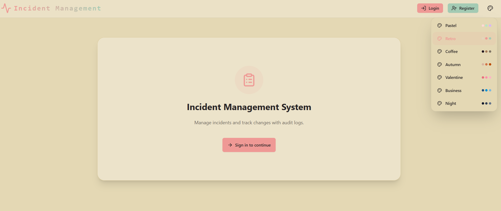
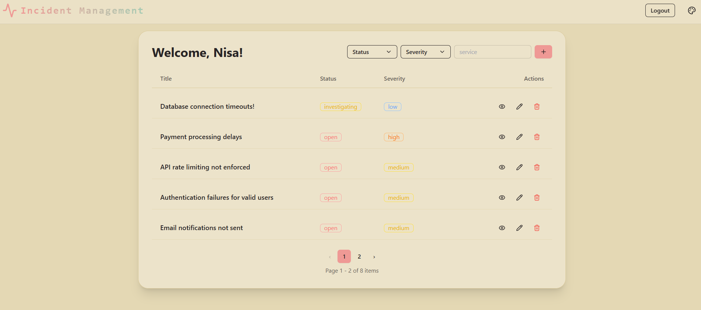

# Incident Management System

Full-stack incident management application with authentication, incident tracking, audit history, real-time updates, and a React user interface.

## 📸 Screenshots

### Dashboard


### Incident List



## Project Setup

### 1. Clone and Install Dependencies

```bash
git clone <repository-url>
cd incident-management

cd backend
npm install

cd ../frontend
npm install
```

### 2. Start Infrastructure

The backend includes Docker Compose services for PostgreSQL and Redis.

```bash
cd backend
docker compose up -d
```

This starts:

- PostgreSQL on `localhost:5432`
- Redis on `localhost:6379`

### 3. Configure Backend Environment

Create `backend/.env` from the example file:

```bash
cd backend
cp .env.example .env
```

### 4. Run the Applications

Start the backend:

```bash
cd backend
npm run dev
```

Start the frontend in another terminal:

```bash
cd frontend
npm run dev
```

Default local URLs:

- UI: `http://localhost:5173`
- API: `http://localhost:3000`
- Swagger API docs: `http://localhost:3000/docs`

### 5. Useful Commands

Backend:

```bash
npm run dev
npm test
```

Frontend:

```bash
npm run dev
```

## Technologies Used

### Backend

- Node.js
- TypeScript
- Express
- TypeORM
- PostgreSQL
- Redis and ioredis
- Socket.IO
- JWT authentication
- bcrypt password hashing
- cookie-parser
- express-rate-limit
- Swagger / OpenAPI
- Jest and ts-jest
- log4js
- Docker Compose

### Frontend

- React
- Vite
- React Router
- Axios
- Socket.IO Client
- Zustand
- Tailwind CSS
- DaisyUI
- Lucide React
- React Hot Toast
- ESLint

## Architecture

The project is organized as a monorepo with separate backend and frontend applications.

```text
h/
  backend/    Express API, authentication, database models, incidents, sockets
  frontend/   React UI, pages, components, API client, socket client
  README.md   Overall project documentation
```

### High-Level Flow

1. The React UI runs on Vite and sends HTTP requests to the backend API at `http://localhost:3000`.
2. Users register or log in through the auth API.
3. Authenticated requests include the access token from local storage.
4. The backend validates JWTs, processes requests through controllers and services, and persists data with TypeORM.
5. PostgreSQL stores users, auth sessions, incidents, and incident audit logs.
6. Redis supports backend caching and related infrastructure utilities.
7. Socket.IO provides real-time communication between backend and frontend.

### Backend Layers

- `src/index.ts`: application bootstrap, middleware, Socket.IO, routes, Swagger, database connection
- `src/auth`: authentication routes, controllers, services, models, middleware, tests
- `src/incident`: incident routes, controllers, services, DTOs, entities, audit logs, validation, tests
- `src/utils`: database, logger, cache, auth helpers, pagination, responses, rate limiting, Swagger, sockets
- `src/config`: environment variable mapping

### Frontend Layers

- `src/App.jsx`: application routes and authenticated user bootstrap
- `src/pages`: page-level views for home, login, and registration
- `src/components`: reusable UI for incidents, navigation, modals, filters, theme selection, and audit logs
- `src/api`: configured Axios client
- `src/utils`: Socket.IO client helpers
- `src/store`: Zustand theme store
- `src/constants`: shared UI constants

## 🚀 Future Improvements

There are several ways this project could be further improved:

- Elasticsearch integration for advanced and faster incident search  
- GraphQL API instead of REST for more flexible data fetching  
- Custom React hooks layer (e.g. `useIncidents`, `useAuth`) to centralize Axios logic  
- Incident comparison feature to analyze and compare incidents by status, severity, or time  
- Database migrations system for safer and version-controlled schema changes  

## Documentation

- Backend-specific documentation: [backend/README.md](backend/README.md)
- UI-specific documentation: [frontend/README.md](frontend/README.md)
